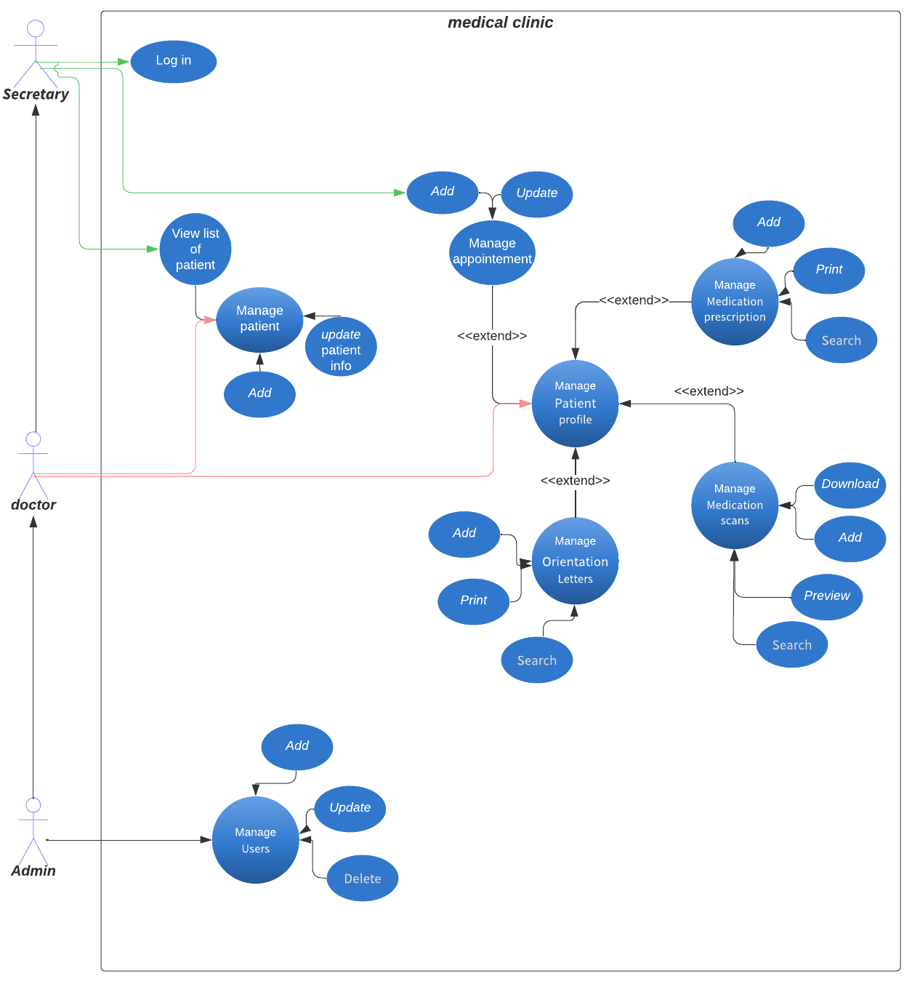
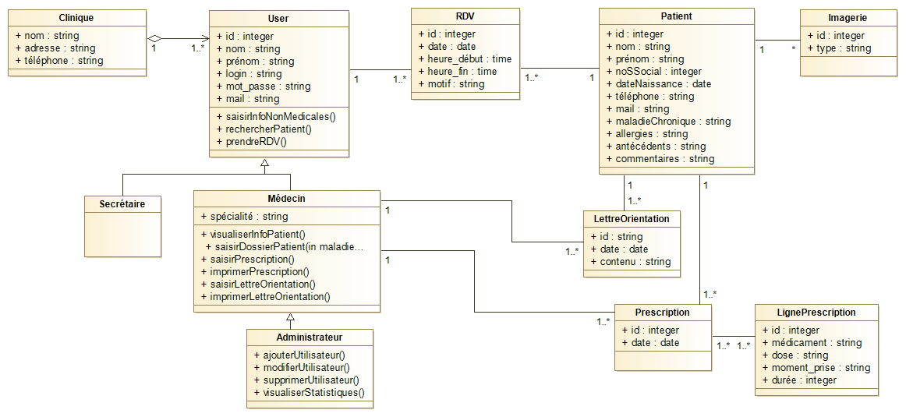

## About laravel medical app:

Medical is a full-stack web application that allows the user to manage a medical clinic.
</br></br>

-   There are three roles in this app, each with a particular level of access:
    </br>

-   **SECRETARY** can:
    1. Login
    2. Create a new appointment
    3. View list of the patients and the doctors in registered in the app.
-   **DOCTOR** can:
    1. Do anything a secretary can do.
    2. Manage the patient assigned to him (_has/had appointment with them_).
    3. Manage the patient's profile (_see the use case diagram_).
-   **ADMIN** can:
    1. Do anything a doctor & secretary can do.
    2. manage users of the app.

</br></br>

## Use Case Diagram:



## Mysql Relatioship Diagram:



## Tech used:

-   Laravel V9 : web application framework
-   AdminLTE Bootstrap Admin Dashboard Template
    </br></br>

## Installation

1. Dependencies install :

    ```bash
    git clone https://github.com/munazzil4/laravel_medical.git
    cd ./laravel_medical

    composer install --ignore-platform-reqs

    npm install
    ```

2. Database setup

    - Create an empty database on phpmyadmin
    - Copy content of `.env.example` into new `.env` file
        ```bash
        cp .env.example .env
        ```
    - Change those values on the `.env` file
        ```env
        DB_CONNECTION=mysql
        DB_HOST=127.0.0.1
        DB_PORT=3306
        DB_DATABASE=db_name
        DB_USERNAME=root
        DB_PASSWORD=db_password
        ```
    - Migrate the database
        ```bash
        php artisan migrate
        ```
    - [Optional]: Seed the database
        ```bash
        php artisan db:seed
        ```

</br></br> 3. Login to the app:

-   if you checked `DatabaseSeeder.php` ,as you will notice that 4 users has been created :

| role      | email                       | password |
| --------- | --------------------------- | -------- |
| Admin     | admin@gmail.com             | 123456   |
| Doctor    | ahmedmunazzil1@gmail.com    | 123456   |
| Doctor    | doctor2@gmail.com           | 123456   |
| Secretary | secretary@gmail.com         | 123456   |
